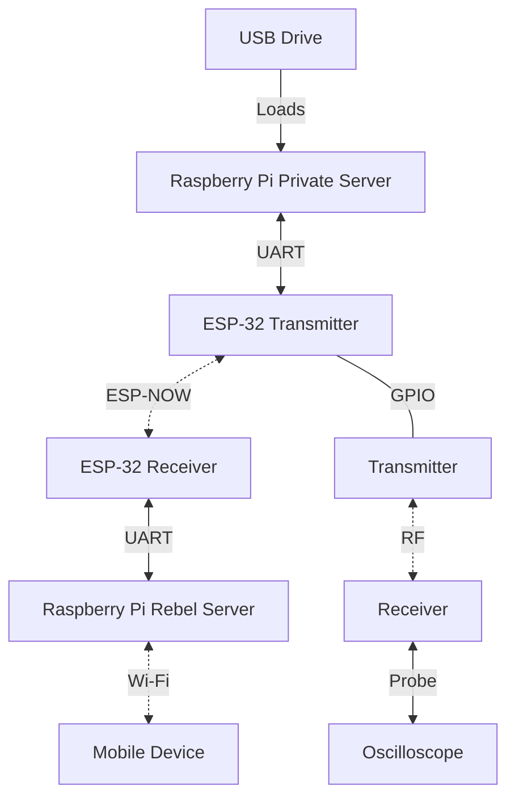

# Hardware Architecture

```mermaid
flowchart TB
    USB["USB Drive"]
    Pi_1["Raspberry Pi Private Server"]
    Pi_2["Raspberry Pi Rebel Server"]
    Mobile["Mobile Device"]

    ESP_1["ESP-32 Transmitter"]
    ESP_2["ESP-32 Receiver"]
    Transmitter["Transmitter"]
    Receiver["Receiver"]
    Oscilloscope["Oscilloscope"]
    
    USB -- "Loads" --> Pi_1
    Pi_1 <-- UART --> ESP_1

    ESP_1 <-. ESP-NOW .-> ESP_2
    ESP_1 -- GPIO --- Transmitter

    ESP_2 <-- UART --> Pi_2
    Pi_2 <-. Wi-Fi .-> Mobile

    Transmitter <-. RF .-> Receiver
    Receiver <-- Probe --> Oscilloscope
```